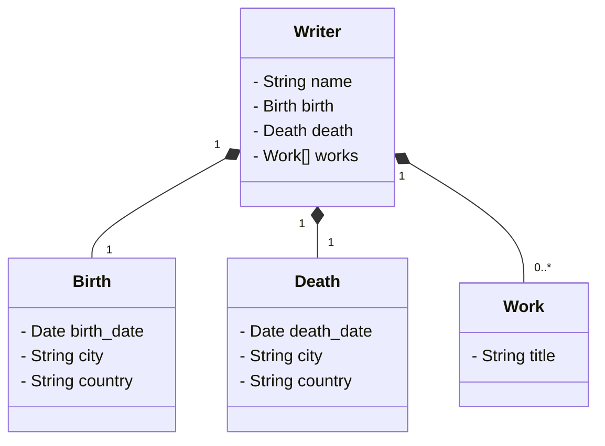

# Escritores-api
Essa é a API Rest de escritores da Literatura Mundial.

## Diagrama de Classes

```mermaid
classDiagram
class Writer {
- String name
- Birth birth
- Death death
- Work[] works
}

class Birth {
- Date birth_date
- String city
- String country
}

class Death {
- Date death_date
- String city
- String country
}

class Work {
- String title
}

Writer "1" *-- "1" Birth
Writer "1" *-- "1" Death
Writer "1" *-- "0..*" Work
```
